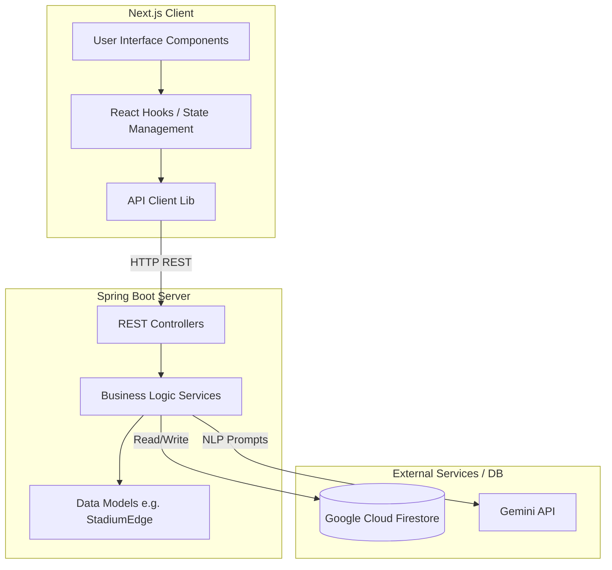

# 🏟️ StadiumMate — GenAI Multilingual Navigation & Crowd-Aware Concierge

> **FIFA World Cup 2026 Hackathon Build** | MetLife Stadium, East Rutherford, NJ

StadiumMate is a Progressive Web App that lets any fan open a browser, ask a navigation question in their own language (by text or voice), and receive a real-time, crowd-aware route narrated back to them — in their language, spoken aloud.

---

## 🎯 Chosen Vertical

**Fan Experience & Stadium Operations** — combining multilingual AI assistance, real-time pathfinding, and live crowd intelligence into a single cohesive product that serves both fans (find my seat) and stadium operators (where are the crowds?).

---

## 🏗️ Architecture

StadiumMate is designed as a typical client-server application with real-time AI and pathfinding capabilities.

*   **Frontend**: Built with **Next.js**, React, and TypeScript. It handles the user interface, renders stadium maps, and provides an interactive chat interface for the AI assistant.
*   **Backend**: Built with **Java Spring Boot**. It exposes REST APIs for AI chat interaction, crowd density updates, game management, and weather data. It is integrated with Firestore for database storage and the Gemini API for natural language processing.

### High-Level Architecture



### Step-by-Step Method Flow

#### A. Frontend Flow
1.  **User Initialization (`app/page.tsx`)**: The user accesses the application. Next.js serves the main layout and the primary interactive page.
2.  **State Management & User Input**: The application uses custom hooks and components to capture user queries (e.g., asking for the best route).
3.  **API Invocation (`lib/`)**: When the user submits a request, asynchronous `fetch` requests are made to the Spring Boot backend.

#### B. Backend Flow
4.  **Controller Layer (`controller/`)**: The backend receives HTTP requests (e.g., `ChatController`, `CrowdController`).
5.  **Service Layer & Business Logic**: Controllers delegate to services, which evaluate graphs via models like `StadiumEdge.java`.
6.  **External Integrations**:
    *   **Gemini API**: Processes natural language intent.
    *   **Firestore**: Fetches/updates the real-time stadium state.
7.  **Response Construction**: Services return DTOs back to the controller, serialized into JSON for the frontend.

#### C. Client Update
8.  **UI Rendering**: The frontend updates React state and re-renders to display the AI's response, path, and crowd metrics.

### Why each AI step is here
| Step | Technology | Why AI (not heuristics)? |
|---|---|---|
| Intent parsing | Gemini 2.0 Flash (JSON mode) | Natural language in any language cannot be reliably parsed with rules — a fan might say "baño", "wc", "toilettes", or "化粧室" for the same destination |
| Route computation | Pure Java A* | Shortest path is math, not language. Keeps the system explainable to judges |
| Narration building | Gemini 2.0 Flash | Generating a warm, contextual sentence in 12+ languages with crowd context is a generative task, not a template fill |
| Voice I/O | Web Speech API (browser) | Free, zero-latency, available on every mobile browser — no GCP cost |

---

## 🗂️ Project Structure

```
challenge4/
├── backend/                      # Java Spring Boot — Cloud Run
│   ├── src/main/java/com/stadiummate/
│   │   ├── controller/           # REST endpoints (chat, crowd)
│   │   ├── service/              # GraphService, RouteService, GeminiService, CrowdService
│   │   ├── model/                # DTOs and graph models
│   │   └── config/               # Firebase, CORS
│   ├── src/main/resources/data/  # Stadium graph JSON + crowd seed
│   ├── src/test/                 # JUnit 5 unit tests
│   ├── Dockerfile                # Multi-stage build (JDK 21 → JRE 21 slim)
│   └── pom.xml
│
├── frontend/                     # Next.js 14 PWA
│   ├── app/                      # App Router (layout, page)
│   ├── components/               # StadiumMap, ChatInterface, CrowdIndicator
│   ├── hooks/                    # useSpeech, useChat
│   ├── lib/                      # api.ts — typed backend client
│   └── public/                   # manifest.json, icons
│
├── scripts/
│   ├── seed-firestore.js         # One-time DB seeder
│   └── simulate-crowd.js         # Live crowd mutation for demo
│
├── infrastructure/
│   ├── firestore.rules           # Firestore security rules
│   └── cloudbuild.yaml           # CI/CD (Cloud Build → Cloud Run)
│
├── .env.example                  # Required env vars
└── README.md
```

---

## 🚀 Setup & Running Locally

### Prerequisites
- Java 21+, Maven 3.9+
- Node.js 20+, npm
- GCP project with **Firestore** and **Cloud Run** APIs enabled
- A [Gemini API key](https://aistudio.google.com/) (free tier)

### 1. Clone and configure

```bash
git clone https://github.com/YOUR_USERNAME/challenge4.git
cd challenge4
cp .env.example .env.local
# Edit .env.local — set GEMINI_API_KEY and GCP_PROJECT_ID
```

### 2. Start the backend

```bash
cd backend

# Export env vars (or add to your shell profile)
export GEMINI_API_KEY=your_key_here
export GCP_PROJECT_ID=your-project-id
export GRAPH_SOURCE=local   # no Firestore needed for local dev

mvn spring-boot:run
# Backend starts on http://localhost:8080
# Health check: GET http://localhost:8080/api/chat/health
```

### 3. Start the frontend

```bash
cd frontend
npm install
# Create frontend env file
echo "NEXT_PUBLIC_API_URL=http://localhost:8080" > .env.local
npm run dev
# Open http://localhost:3000
```

### 4. (Optional) Seed Firestore and use live crowd state

```bash
# Install seed script dependencies
npm install firebase-admin  # in the scripts dir or globally

# Seed the database
GCP_PROJECT_ID=your-project-id node scripts/seed-firestore.js

# Change backend to Firestore mode
export GRAPH_SOURCE=firestore
# Restart the backend

# Run the crowd simulator in a separate terminal
GCP_PROJECT_ID=your-project-id node scripts/simulate-crowd.js
```

---

## 🧪 Testing

### Backend unit tests

```bash
cd backend
mvn test
# Runs RouteServiceTest (A* pathfinding) and GeminiServiceTest (mocked API)
```

### Frontend tests

```bash
cd frontend
npm test
```

### Manual smoke test (curl)

```bash
# English restroom request
curl -X POST http://localhost:8080/api/chat \
  -H "Content-Type: application/json" \
  -d '{"message":"Where is the nearest accessible restroom?","currentLocation":"GATE_A"}'

# Spanish food court request
curl -X POST http://localhost:8080/api/chat \
  -H "Content-Type: application/json" \
  -d '{"message":"¿Dónde está la comida?","currentLocation":"SEC_214"}'

# Simulate crowd spike (triggers rerouting on next chat)
curl -X POST http://localhost:8080/api/crowd/simulate \
  -H "Content-Type: application/json" \
  -d '{"zoneId":"ZONE_CONC_NE","level":0.9}'
```

---

## 🎬 Demo Script (4 minutes)

### Scene 1 — English, text input
> "Where's the nearest accessible restroom to Section 214?"

Expected: Route drawn on SVG map from SEC_214 → CONC_UPPER_SE → ELEV_E → GATE_A → REST_E or REST_N_ACC. Gemini narrates in English.

### Scene 2 — Spanish, voice input
Click the 🎤 button, speak:
> "¿Dónde está la salida norte?"

Expected: Gemini detects Spanish, computes route to GATE_B, narrates in Spanish, Web Speech API reads it aloud.

### Scene 3 — Crowd-aware rerouting (the money shot)
1. Ask: "How do I get from Gate A to the food court?"
   → Normal route goes NE concourse (CONC_MAIN_NE)
2. Click **⚡ Demo** in the header, select **NE Concourse**, drag level to 90%, click **🚨 Spike Crowd**
3. Ask the same question again
   → A* reroutes via Gate B (south path), Gemini says: *"The northeast corridor is currently very busy — I've rerouted you through the north entrance instead. Head to Gate B and you'll find the food court just inside."*

### Scene 4 — Architecture (30 seconds)
> "Gemini does language. A* does math. That's the design."

---

## ☁️ Deploying to Cloud Run

### Prerequisites
- `gcloud` CLI authenticated
- APIs enabled: Cloud Run, Cloud Build, Container Registry, Vertex AI, Firestore

```bash
# Set project
gcloud config set project YOUR_PROJECT_ID

# Store API key as a Secret
echo -n "your_gemini_api_key" | gcloud secrets create gemini-api-key \
  --data-file=-

# Trigger Cloud Build (auto-deploys backend + frontend)
gcloud builds submit . --config infrastructure/cloudbuild.yaml

# Seed Firestore after deploy
GCP_PROJECT_ID=your-project-id node scripts/seed-firestore.js
```

---

## 🔒 Security

- API key stored in **Google Cloud Secret Manager**, not in code
- Backend runs as **non-root user** in Docker
- CORS restricted to known frontend origins via `ALLOWED_ORIGINS` env var
- Firestore rules: public read, write requires authenticated service account
- No fan PII stored — sessions use random UUID v4 identifiers only
- Input validation on all REST endpoints (`@NotBlank`, `@Size`)

---

## ♿ Accessibility

- WCAG 2.1 AA colour contrast on all text elements
- All interactive elements have `aria-label` attributes
- Live regions (`aria-live="polite"`) for chat updates and crowd warnings
- Focus ring visible on all interactive elements
- `prefers-reduced-motion` CSS media query disables animations
- Language selector and location selector are labelled form controls
- Route steps read as a structured list with semantic roles

---

## 📊 Google Services Used

| Service | Usage |
|---|---|
| **Vertex AI / Gemini 2.0 Flash** | Intent parsing (JSON mode) + multilingual narration |
| **Cloud Run** | Hosts Java backend (auto-scales to zero) |
| **Firestore** | Stadium graph storage + live crowd state |
| **Cloud Build** | CI/CD pipeline — test → build → deploy |
| **Secret Manager** | Gemini API key storage |
| **Container Registry** | Docker image storage |

---

## 🔧 Assumptions

1. **Stadium graph**: MetLife Stadium graph (~31 nodes) is manually traced from public seating charts. It models walkable corridors, not every physical inch. Edge weights are approximate metre distances; the A* heuristic is calibrated to this scale.

2. **Crowd data**: Crowd congestion is simulated via Firestore writes from `scripts/simulate-crowd.js`. In a production deployment, this would be replaced by real IoT sensor feeds, computer vision crowd counts, or ticketing system occupancy data.

3. **Voice**: Web Speech API quality varies by browser and OS. Chrome Desktop provides the best results. iOS Safari has partial support. The system gracefully degrades to text-only if voice is unavailable.

4. **Language support**: Gemini 2.0 Flash supports all major languages for both intent parsing and narration. The Web Speech API TTS quality for non-English languages depends on which voices are installed in the user's OS.

5. **Accessible restrooms**: The graph marks `REST_N_ACC` and `REST_S_ACC` as wheelchair-accessible. When a fan asks for an "accessible restroom", A* finds the nearest of these two nodes.

---

## 📝 Approach & Logic

The core design decision is a **clean separation of concerns between AI and algorithms**:

- **Gemini** handles everything language-related: detecting what language the fan speaks, what they want, and expressing the route naturally in their language. It does not compute paths.
- **A*** handles everything math-related: finding the shortest weighted path in a graph. It does not understand language.
- **Crowd state** is an additional signal — it adjusts edge weights before A* runs, so the same algorithm that works in an empty stadium automatically handles congestion without any AI involvement.

This design is deliberate. It makes the system **explainable** ("the route changed because the congestion multiplier on CONC_MAIN_NE exceeded 4×"), **testable** (the routing algorithm has pure unit tests with no API mocks), and **maintainable** (swap Gemini for any LLM without touching the routing code).

---

## 📜 License

MIT — see [LICENSE](LICENSE) for details.
