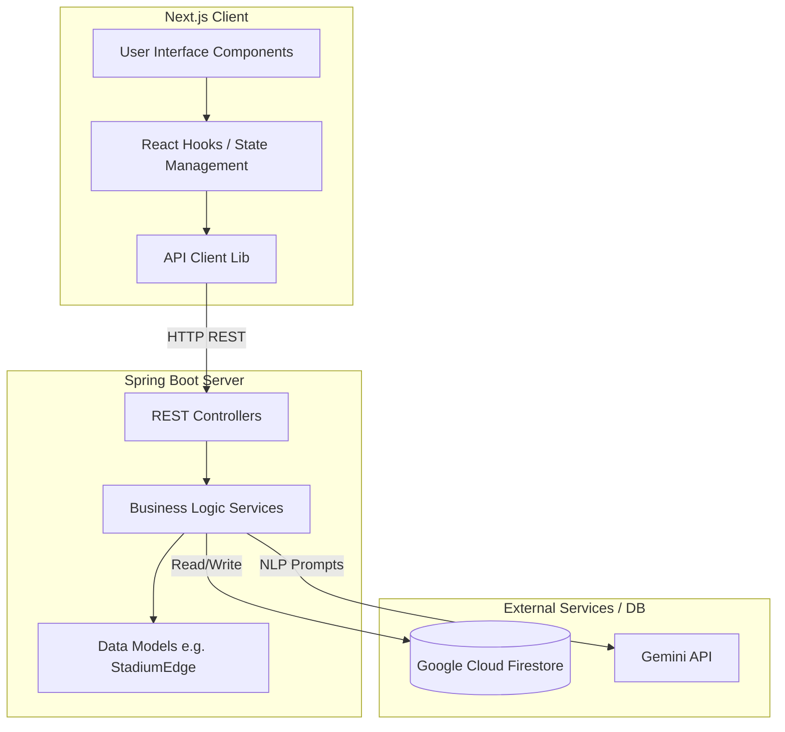

# StadiumMate Architecture & Method Flow

This document outlines the step-by-step method flow and architectural design of the StadiumMate application, which consists of a Next.js frontend and a Java Spring Boot backend.

## 1. System Architecture Overview

StadiumMate is designed as a typical client-server application with real-time AI and pathfinding capabilities.

*   **Frontend**: Built with **Next.js**, React, and TypeScript. It handles the user interface, renders stadium maps, and provides an interactive chat interface for the AI assistant.
*   **Backend**: Built with **Java Spring Boot**. It exposes REST APIs for AI chat interaction, crowd density updates, game management, and weather data. It is integrated with Firestore for database storage and the Gemini API for natural language processing.

### Mermaid Diagram: High-Level Architecture

---

## 2. Step-by-Step Method Flow

### A. Frontend Flow
1.  **User Initialization (`app/page.tsx`)**:
    *   The user accesses the application. Next.js serves the main layout (`app/layout.tsx`) and the primary interactive page (`app/page.tsx`).
2.  **State Management & User Input**:
    *   The application uses custom hooks (`hooks/`) and components (`components/`) to capture user queries (e.g., asking for the best route to their seat).
3.  **API Invocation (`lib/`)**:
    *   When the user submits a request, a function in the `lib` directory packages the payload and makes asynchronous `fetch` (or Axios) HTTP requests to the Spring Boot backend.

### B. Backend Flow
4.  **Controller Layer (`src/main/java/com/stadiummate/controller/`)**:
    *   The backend receives the HTTP request at the relevant controller:
        *   `ChatController.java`: Handles user natural language queries and AI assistance.
        *   `CrowdController.java`: Manages requests for real-time crowd densities to adjust pathfinding.
        *   `GameController.java`: Retrieves game schedule and metadata.
        *   `WeatherController.java`: Handles weather-related data.
5.  **Service Layer & Business Logic**:
    *   The controllers delegate the logic to service classes. For instance, if a user asks for a path, the service evaluates graph edges using models like `StadiumEdge.java`.
6.  **External Integrations**:
    *   The service may make external calls:
        *   **Gemini API**: To process the user's natural language request and determine intent.
        *   **Firestore**: To fetch or update the real-time state of the stadium (e.g., graph structures, node data).
7.  **Response Construction**:
    *   The service returns data models/DTOs back to the controller, which serializes them into JSON and sends a 200 OK HTTP response back to the Next.js frontend.

### C. Client Update
8.  **UI Rendering**:
    *   The frontend receives the JSON response, updates the local React state, and re-renders the UI to display the AI's response, dynamic path on the stadium map, or updated crowd metrics to the user.
